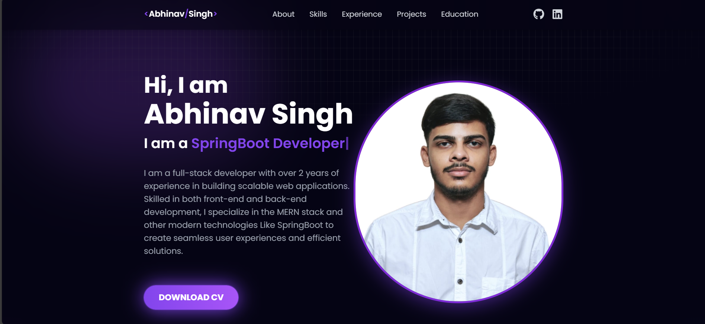

# 💼 Abhinav's Portfolio

This is my personal developer portfolio built using **React** and **Vite**, styled with **Tailwind CSS**, and deployed on **Vercel**. The site showcases my projects, skills, and contact information in a clean, responsive design.

---

## 🚀 Tech Stack

- **React** (via [Vite](https://vitejs.dev/)) — Fast and modern front-end tooling
- **Tailwind CSS** — Utility-first CSS framework for styling
- **Vercel** — Hosting platform with CI/CD for seamless deployment
- **JavaScript (ES6+)**

---

## 🌐 Live Demo

🔗 [abhinav-portfolio-2025.vercel.app](https://abhinav-portfolio-2025.vercel.app/)

---

## 📁 Project Structure

```
abhinav-portfolio/
├── public/
├── src/
│   ├── assets/
│   ├── components/
│   ├── constants/   ← 🔧 Contains `constants.js` for easy content updates
│   ├── pages/
│   ├── App.jsx
│   └── main.jsx
├── tailwind.config.js
├── vite.config.js
└── ...
```

---

## ✏️ How to Update Content

To update portfolio content (projects, skills, contact info, etc.):

1. Navigate to:

   ```
   src/constants/constants.js
   ```

2. Modify the relevant arrays/fields:

   - `projects`
   - `skills`
   - `socials`
   - `about`

3. Save the file — Vite will hot reload your changes locally.

⚠️ No need to touch component or layout files for basic content updates.

---

## 🛠️ Getting Started (Development)

### 1. Clone the Repository

```bash
git clone https://github.com/Abhinav-2004/Abhinav-portfolio.git
cd Abhinav-portfolio
```

### 2. Install Dependencies

```bash
npm install
```

### 3. Run the Dev Server

```bash
npm run dev
```

The app will be running locally at [http://localhost:5173](http://localhost:5173)

---

## 🚀 Deployment with Vercel

This project is **automatically deployed** via Vercel:

- Connect the repo to your [Vercel dashboard](https://vercel.com/dashboard)
- Set up the project (Vercel auto-detects Vite)
- Every push to the `main` branch will trigger a new deployment

🔁 **Continuous Deployment (CI/CD)** is handled automatically.

---

## 📸 Screenshots



<!-- Add screenshots or a short GIF here if you want -->

---

## 📃 License

This project is open-source and free to use — feel free to fork, clone, or contribute!

---

## 🙌 Connect with Me

- GitHub: [@Abhinav-2004](https://github.com/Abhinav-2004)
- LinkedIn: [linkedin.com/in/your-profile](https://www.linkedin.com/in/abhinav-singh-11b748213/)

---

Built with ❤️ by Abhinav
